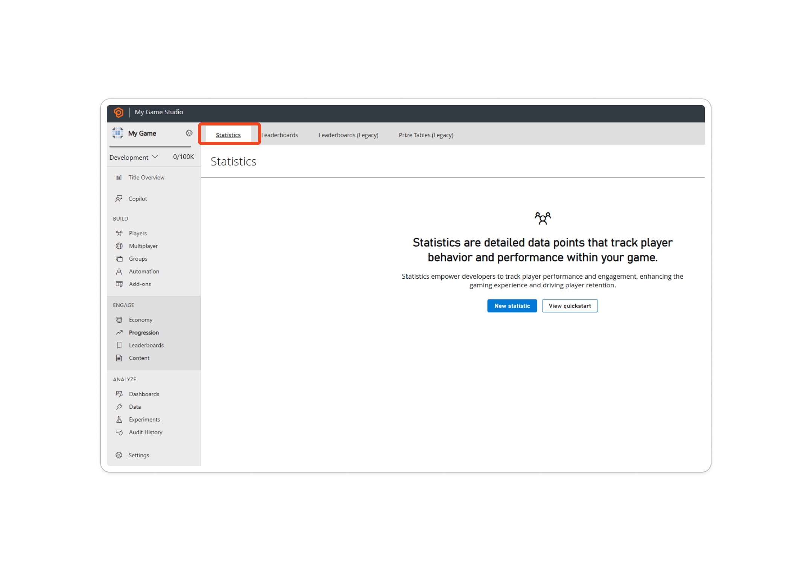
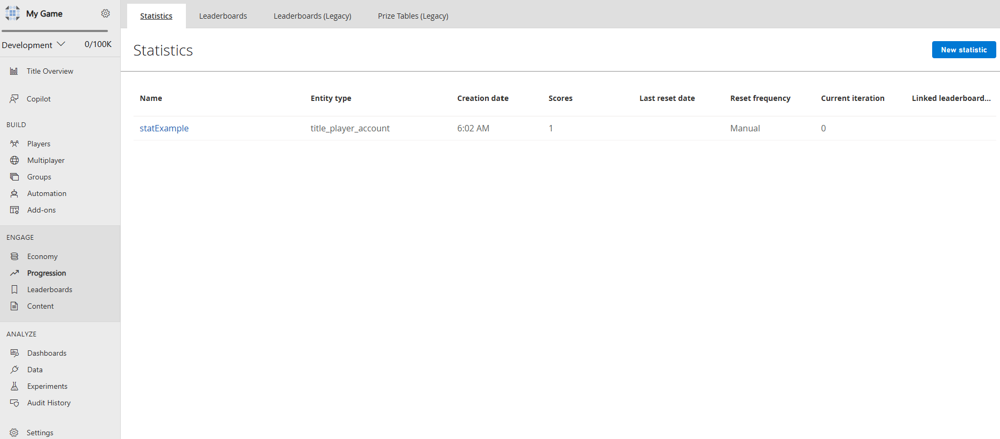
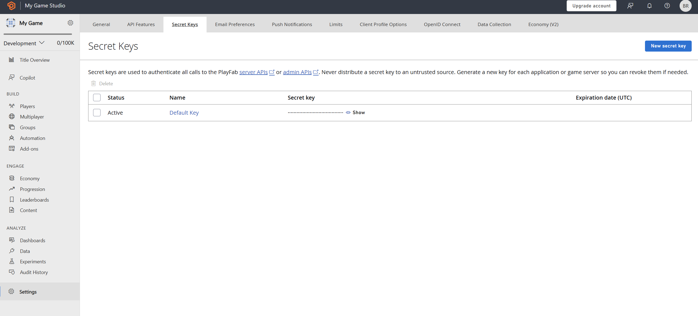

# Quickstart statistics

In this guide, we're going to see how to set up the development environment for the Statistics service. We're also going
to learn how to create a quick leaderboard from our website [Game Manager](https://developer.playfab.com/en-US/login).

## Prerequisites

We're going to need a PlayFab account to use the PlayFab Statistics service. For instructions to create an account, 
see [Authentication](../../authentication/authentication/index.md).

## Creating a Statistic

We're going to select Progression on the left menu.


We now select Statistics tab from the upper menu.



After, that we're going to go "New Statistic" button and create our statistic definition.


Here we're able to configure every aspect of the statistic. Learn more about the parameters available and 
how to create statistics here:
- [Create Basic Leaderboard](create-basic-statistics.md).
- [API Reference](api-reference.md)

The final result should be like this.



## Setting up the environment

Here we're going to learn how to set up the developer environment to use the C# SDK, but the concepts
presented here can also work with other SDKs or plain HTTP requests.

## Setting TitleId and DeveloperSecretKey

DeveloperSecretKey is needed when authenticating as Title Entity. 

``` C#
PlayFabSettings.staticSettings.TitleId = ""; // Change this value to your own titleId from PlayFab Game Manager
PlayFabSettings.staticSettings.DeveloperSecretKey = ""; // Change this to your title's secret key from Game Manager
```

## Creating a title and getting the secret key

- Log in to https://playfab.com/
- Create a title
    - Find the Title ID in the API Features section under settings.   
- Generate secret key:
  - Cog next to title name in top left of title view
  - Title Settings
  - Secret Keys
  - New secret key

Here's how the UI looks like when you find the Secret Key section within Game Manager.



## Login as Title

For write operations we recommend using the TitleEntity from your game server, this method is going to return the `AuthenticationContext` that is
going to be used across all the requests we made.

``` C#
public static async Task<PlayFabAuthenticationContext> LoginAsTitleEntity()
{
    GetEntityTokenRequest request = new GetEntityTokenRequest()
    {
        Entity = new PlayFab.AuthenticationModels.EntityKey()
        {
            Id = PlayFabSettings.staticSettings.TitleId,
            Type = "title",
        },                
    };

    PlayFabResult<GetEntityTokenResponse> entityTokenResult = await PlayFabAuthenticationAPI.GetEntityTokenAsync(request);

    PlayFabAuthenticationContext authContext = new PlayFabAuthenticationContext
    {
        EntityToken = entityTokenResult.Result.EntityToken
    };
    
    return authContext;
}
```

## Login as Player (create Player)

Log in as the player for read operations directly against PlayFab APIs. This method is going to return the `AuthenticationContext` that is
going to be used across all the requests we made.

``` C#
private static async Task<PlayFabAuthenticationContext> LoginAsPlayer(string customId = "GettingStartedGuide")
{
    LoginWithCustomIDRequest request = new LoginWithCustomIDRequest { CustomId = customId, CreateAccount = true };

    PlayFabResult<LoginResult> loginResult = await PlayFabClientAPI.LoginWithCustomIDAsync(request);

    return loginResult.Result.AuthenticationContext;
}

```


## See also

- [Create Basic Statistics](create-basic-statistics.md).
- [Doing More With Statistics](doing-more-statistics.md).
- [Seasonal Statistics](seasonal-statistics.md).
- [Add Contextual Data to Statistics](metadata-statistics.md).
- [API Reference](api-reference.md).
- [Statistics Meters](../../pricing/meters/statistics-meters.md).
